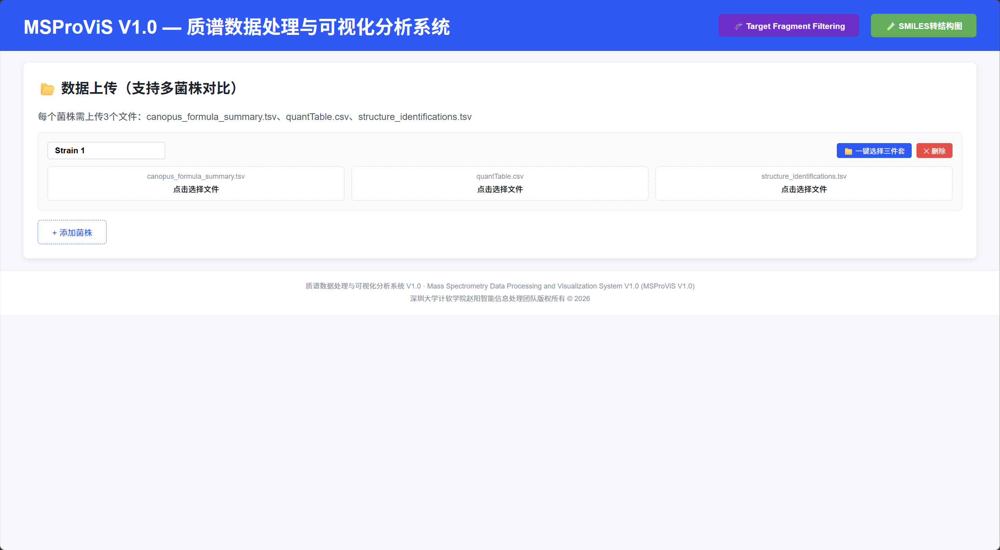
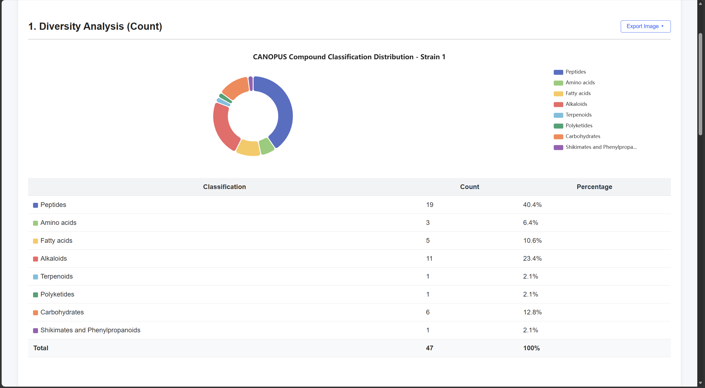
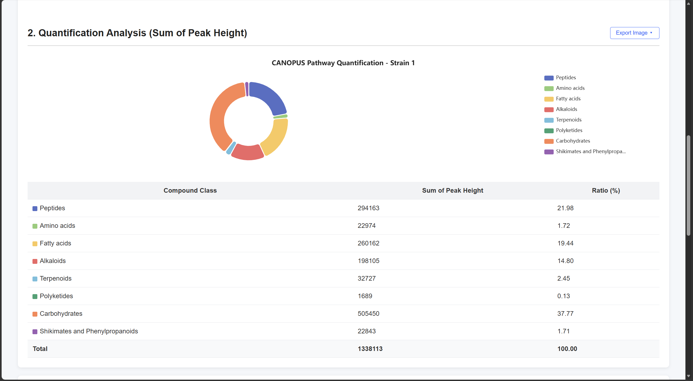
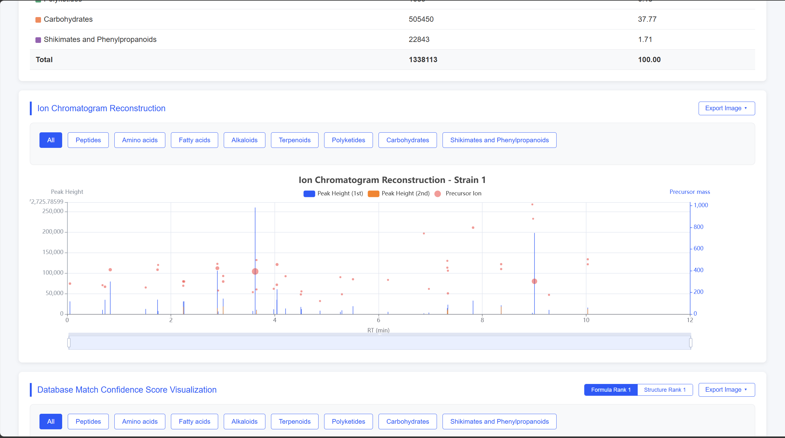
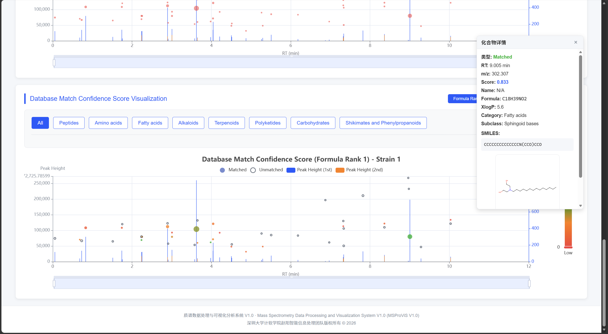
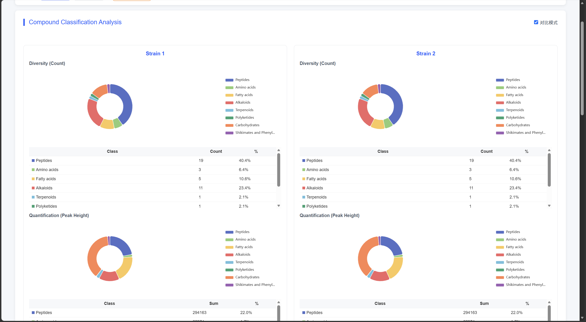
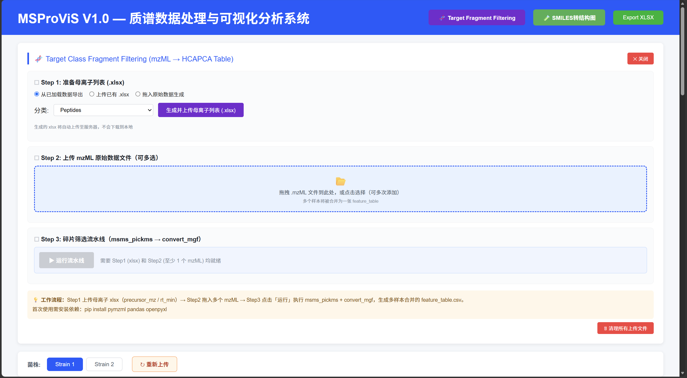

# MSProViS V1.0 — 质谱数据处理与可视化分析系统

**Mass Spectrometry Data Processing and Visualization Analysis System V1.0 (MSProViS V1.0)**

---

## 简介 / Introduction

MSProViS 是一个面向天然产物高分辨质谱数据的**本地化**数据处理与可视化分析平台：向下承接 SIRIUS 鉴定输出（多表容差整合与清洗），向上支撑下游定量分析与 AI 建模（输出标准化特征表），为跨菌株比较研究与目标化合物碎片筛选提供一站式图形化工作流。

*MSProViS is a **localized** data processing and visualization platform for high-resolution mass spectrometry data of natural products. It takes SIRIUS output as its upstream input (integrating and cleaning multiple tables with tolerance matching), and feeds downstream quantitative analysis and AI modeling with standardized feature tables, providing a one-stop graphical workflow for cross-strain comparative studies and target-compound fragment screening.*

---

## 主要功能 / Features

- **多表智能联结**：一键上传 `canopus_formula_summary.tsv`、`quantTable.csv`、`structure_identifications.tsv` 三个文件，系统自动完成三表数据的精准匹配与合并。
  *One-click multi-table integration: upload the three files (`canopus_formula_summary.tsv`, `quantTable.csv`, `structure_identifications.tsv`) at once, and the system automatically matches and merges the tables precisely.*

- **多菌株对比**：支持多个菌株同时上传和对比分析，所有图表统一量程，可并排对比饼图、纵向堆叠色谱图。
  *Multi-strain comparison: upload and compare multiple strains simultaneously; all charts share unified scales, with side-by-side pie charts and vertically stacked chromatograms.*

- **化合物深度分类修正**：针对多肽类化合物自动细分亚类，识别环肽、线性肽、脂肽、糖肽等复杂类别。
  *Deep compound classification: peptides are automatically subclassified into cyclic peptides, linear peptides, lipopeptides, glycopeptides, and other complex categories.*

- **9 分类固定颜色方案**：每个化合物分类绑定独立颜色，所有图表（饼图、色谱图、置信度图）颜色全局一致。
  *Fixed color scheme for the 9 major classes: each compound class is bound to a distinct color, keeping all charts (pies, chromatograms, confidence plots) visually consistent.*

- **Formula / Structure Rank 切换**：支持按分子式排名（formulaRank=1）与按结构排名（structurePerIdRank=1）两种模式切换查看置信度数据。
  *Formula / Structure Rank switching: toggle between confidence data ranked by molecular formula (formulaRank=1) and by structure (structurePerIdRank=1).*

- **交互式可视化**（基于 ECharts Canvas 渲染）：CANOPUS 化合物分类饼图（Diversity 计数统计与 Quantification 峰高总和）、双 Y 轴离子色谱重建图（Peak Height 柱状 + Precursor mass 散点，ALL 背景淡化）、数据库匹配置信度分布图（连续颜色编码，点击弹窗显示分子式与分子结构图）。
  *Interactive visualization (ECharts, Canvas rendering): CANOPUS classification pie charts (Diversity count and Quantification sum of peak heights); dual-Y-axis ion chromatogram reconstruction (peak-height bars plus precursor-mass scatter points, with the ALL series dimmed as background); database match confidence distribution (continuous color coding; click for molecular formula and structure image).*

- **外部数据库集成与 SMILES 结构图**：支持 PubChem 与 GNPS 数据库的一键穿透检索；SMILES 字符串实时渲染为分子结构图，并提供批量转换工具。
  *External database integration & SMILES structures: one-click look-up in PubChem and GNPS; SMILES strings are rendered into molecular structure images in real time, with a batch conversion tool provided.*

- **Target Fragment Filtering（目标分类碎片筛选）**：三步自动化流水线——Step1 通过三种互斥方式（从已加载数据导出 / 上传已有 xlsx / 拖入原始数据生成）导出母离子列表；Step2 批量上传 mzML 原始谱图；Step3 自动运行碎片筛选与特征表转换，输出可供下游定量分析与 AI 建模直接使用的标准特征表 CSV 及 MGF 碎片文件。
  *Target Fragment Filtering: a three-step automated pipeline — Step 1 exports a precursor list via three mutually exclusive methods (export from loaded data / upload an existing xlsx / drag in raw data files); Step 2 uploads mzML raw spectra in batch; Step 3 automatically runs fragment filtering and feature-table conversion, producing a standardized feature table (CSV) and MGF fragment files ready for downstream quantitative analysis and AI modeling.*

---

## 📸 界面预览 / Screenshots

**登录页**：输入团队发放的账号与密码登录，或导入授权文件后登录。
*Login page: sign in with the account and password issued by the team, or import your authorization file first.*

  

**数据上传**：每个菌株上传三份 SIRIUS 输出文件（canopus / quantTable / structure），支持多菌株同时上传对比。
*Data upload: upload the three SIRIUS output files per strain (canopus / quantTable / structure); multiple strains can be uploaded for comparison.*

  

**分类统计**：Diversity（化合物数量统计）与 Quantification（峰高总和定量）双饼图，固定颜色方案保证跨菌株视觉一致。
*Classification statistics: Diversity (compound count) and Quantification (sum of peak heights) pie charts with a fixed color scheme for cross-strain consistency.*

  

**定量分析**：各化合物分类的峰高总和占比（Quantification），与数量统计互为补充。
*Quantification analysis: sum-of-peak-height share of each compound class, complementing the count statistics.*

  

**离子流图重建**：双 Y 轴离子色谱重建图——Peak Height 柱状（1st/2nd 双柱）与 Precursor mass 散点（点大小随峰高），支持按分类/亚类筛选。
*Ion chromatogram reconstruction: dual-Y-axis chart with peak-height bars (1st/2nd) and precursor-mass scatter points (size scaled by peak height); filterable by class/subclass.*

  

**数据库匹配置信度**：Matched 散点按置信度连续着色（红→橙→绿），Unmatched 以空心点标注；点击弹窗查看化合物详情与分子结构图。
*Database match confidence: matched points colored continuously by confidence (red→orange→green), unmatched as hollow points; click for compound details and structure image.*

  

**多菌株对比**：勾选对比模式后并排展示所有菌株的迷你饼图与统计表，量程全局统一。
*Multi-strain comparison: enable compare mode for side-by-side mini pie charts and statistics with unified scales.*

  

**目标分类碎片筛选**：三步流水线——准备母离子列表 → 上传 mzML → 运行碎片筛选，输出标准特征表。
*Target fragment filtering: three-step pipeline — prepare precursor list → upload mzML → run fragment filtering, outputting a standardized feature table.*

  

---

## 系统要求 / System Requirements

| 项目 / Item | 要求 / Requirement |
|---|---|
| 操作系统 / Operating System | Windows 10 / 11 64 位 / Windows 10 / 11 (64-bit) |
| 处理器 / CPU | 双核 2.0 GHz 及以上 / Dual-core 2.0 GHz or higher |
| 内存 / Memory | 4 GB 及以上 / 4 GB or more |
| 硬盘 / Disk | 可用空间 2 GB 及以上 / 2 GB or more of free space |
| 浏览器 / Browser | 最新版 Chrome、Edge 或 Firefox / Latest Chrome, Edge, or Firefox |
| 网络 / Network | 安装后无需联网即可使用 / No internet connection required after installation |

---

## 下载与安装 / Download & Installation

- **下载安装包**：前往 **[Releases](https://github.com/guanyi2007/MSProViS-Release/releases)** 页面下载最新版 `MSProViS_V1.0_Setup.exe`（安装包含完整 Python 3.11 运行时，目标机器无需预装 Python、无需联网）。
  *Download the installer: get the latest `MSProViS_V1.0_Setup.exe` from the **Releases** page. The installer bundles a complete Python 3.11 runtime — no Python installation or internet connection is needed on the target machine.*

- **安装**：双击安装包，按向导提示完成安装（默认安装至 Program Files；用户数据自动存放于 `%APPDATA%\MSProViS\`，与安装目录分离）。
  *Install: double-click the installer and follow the wizard (default directory: Program Files; user data is stored automatically in `%APPDATA%\MSProViS\`, separate from the installation directory).*

- **启动**：安装完成后双击桌面或开始菜单中的 **MSProViS** 快捷方式启动软件，浏览器会自动打开 `http://localhost:8000`。
  *Launch: after installation, double-click the **MSProViS** shortcut on the desktop or in the Start menu, and your browser will open `http://localhost:8000` automatically.*

- **安装目录附赠详细说明**：安装完成后，安装目录内附有一份完整的中文版使用说明（`README.md`），包含数据处理逻辑、使用边界、输入数据格式等更详细的内容，可在安装目录中随时查阅。
  *Detailed guide included: after installation, a complete Chinese user guide (`README.md`) is included in the installation directory, covering data-processing logic, usage boundaries and input formats in more detail — feel free to consult it at any time.*

---

## 申请使用与账号获取 / How to Get Access

MSProViS 免费供学术研究使用，但**必须先申请账号**才能登录使用：

*MSProViS is free for academic research, but an account is **required** before you can sign in:*

1. **下载并填写《使用申请表》**：[MSProViS_Application_Form.pdf](MSProViS_Application_Form.pdf)（中英文对照；须完整填写全部必填项，并签署所有承诺条款）。
   *Download and fill in the **Application Form**: [MSProViS_Application_Form.pdf](MSProViS_Application_Form.pdf) (bilingual; complete all mandatory items and sign the release agreement).*

2. **发送至**：`zhaoyang1990@szu.edu.cn`（Dr. Zhao Yang / 赵阳博士）。
   *Send it to: `zhaoyang1990@szu.edu.cn` (Dr. Zhao Yang).*

3. **审核通过后**，您将通过两条独立渠道收到**授权文件（.json）**与**登录密码**。
   *After approval, you will receive an **authorization file (.json)** and a **password** via two separate channels.*

4. **导入并登录**：在登录页点击「📥 导入授权文件」选择收到的 `.json` 文件，然后输入您的邮箱与收到的密码即可进入软件。
   *Import and sign in: click "📥 Import Authorization File" on the login page and select the received `.json` file, then enter your email and the password you received.*

> 账号由团队审核发放，请勿转借、出租或转让账号；忘记密码请联系团队重置。
> *Accounts are issued after review by the team. Do not lend, rent or transfer your account. If you forget your password, please contact the team to reset it.*

---

## 🚀 快速体验 / Try It with Sample Data

安装包**自带示例数据**（`sample_data/`），获得账号并登录后，无需准备自己的质谱数据即可立即体验完整分析流程：在数据上传区选择示例数据菌株卡片，一键上传三个示例文件 → 点击「开始处理并可视化」→ 浏览全部图表与分析结果。

*The installer **ships with sample data** (`sample_data/`). After obtaining an account and signing in, you can experience the full workflow immediately without preparing your own MS data: select the sample strain card in the upload area, upload the three sample files in one click, click "Start Processing", and explore all charts and results.*

---

## 数据处理逻辑 / Data Processing Logic

为了让分析结果可解释、可复现，软件的核心数据处理规则如下（与上游需求文档约定一致）：

*To keep analysis results interpretable and reproducible, the core data-processing rules are as follows (consistent with the agreed upstream requirements):*

- **三表容差联结**：以 canopus 分类表为主表，将其 `ionMass` 与 `retentionTimeInMinutes` 四舍五入到 3 位小数后，与 quantTable 表的 `row m/z`、`row retention time` 以及 structure 表的 `ionMass`、`retentionTimeInMinutes` 比较相等，从而关联峰高与结构鉴定（匹配精度为 0.001 m/z × 0.001 min）。
  *Three-table tolerance matching: using the canopus table as the master, its `ionMass` and `retentionTimeInMinutes` are rounded to 3 decimal places and compared for equality with `row m/z` / `row retention time` in quantTable and with `ionMass` / `retentionTimeInMinutes` in the structure table, linking peak heights and structure identifications (matching precision: 0.001 m/z × 0.001 min).*

- **数据范围与无效行处理**：canopus 表中没有 `molecularFormula` 的行不参与任何统计；三表联结后匹配不到 quantTable 峰高的化合物（两表数据量不一致时常见）仍计入 Diversity 计数，但不出现在离子流图与置信度图中，也不计入 Quantification 定量。
  *Data scope and invalid rows: rows in the canopus table without a `molecularFormula` are excluded from all statistics; compounds that cannot be matched to a peak height in quantTable (common when the two tables differ in size) are still counted in Diversity, but do not appear in the ion chromatogram or confidence plots, nor in Quantification statistics.*

- **分类修正**：将 `Amino acids and Peptides` 大类按 NPC#class 细分为 `Amino acids` 与 `Peptides`；多肽类再根据 NPC#class 与 ClassyFire 字段的关键词自动识别亚类——含 `cyclic` 或（含 `depsipeptide` 且不含 `linear`）→ 环肽；含 `linear` → 线性肽；含 `lipopeptide` → 脂肽；含 `glycopeptide` 或 `aminoglycoside`（氨基糖苷）→ 糖肽；未命中关键词的多肽保留原始 NPC#class 作为亚类。
  *Classification correction: the `Amino acids and Peptides` pathway is split into `Amino acids` and `Peptides` by NPC#class; peptides are further subclassified by keywords in the NPC#class and ClassyFire fields — `cyclic` (or `depsipeptide` without `linear`) → cyclic peptides; `linear` → linear peptides; `lipopeptide` → lipopeptides; `glycopeptide` or `aminoglycoside` → glycopeptides; peptides matching no keyword keep their original NPC#class as the subclass.*

- **Top-2 峰筛选（仅影响图表显示）**：同一保留时间出现多个离子峰时，按峰高降序仅保留前 2 名用于图表显示（1st 蓝色 / 2nd 橙色）；Quantification 定量统计使用全量数据求和，不受此过滤影响。
  *Top-2 peak selection (display only): when multiple ion peaks share the same retention time, only the top 2 by peak height are kept for chart display (1st blue / 2nd orange); the Quantification statistics sum over all data and are not affected by this filter.*

- **双 Rank 通道**：`formulaRank=1` 与 `structurePerIdRank=1` 分别独立筛选各自的最优鉴定候选行，同一化合物在候选行中取 ConfidenceScoreApproximate 最高的结构记录（匹配不到结构时标记为 Unmatched，置信度图中以空心点显示），因此同一峰点在两种模式下的匹配状态与置信度可能不同，属设计预期。
  *Dual rank channels: `formulaRank=1` and `structurePerIdRank=1` each independently select their best identification candidate; for each compound the structure record with the highest ConfidenceScoreApproximate is taken (compounds with no match are marked Unmatched and shown as hollow points in the confidence plot). A given peak may therefore show different match status and confidence in the two modes, which is by design.*

- **碎片筛选流水线**：`msms_pickms` 按 20 PPM 质量容差与 ±0.2 min 保留时间窗口匹配候选 MS2 谱，选择包含母离子峰（0.1 Da 容差）且共有碎片最多的最优谱（母离子列表含 `strain` 菌株列时，按 mzML 文件名与菌株名最长匹配、不区分大小写过滤）；`convert_mgf` 合并各样本生成标准特征表（行 = m/z-RT 特征、列 = 样本、值 = 强度，缺失值填 0），强度 ≤10 的碎片峰作为噪声过滤。
  *Fragment filtering pipeline: `msms_pickms` matches candidate MS2 spectra within a 20 PPM mass tolerance and a ±0.2 min retention-time window, selecting the best spectrum that contains the precursor peak (0.1 Da tolerance) and shares the most fragments (if the precursor list has a `strain` column, precursors are filtered by the longest case-insensitive match between the mzML filename and the strain name); `convert_mgf` merges all samples into a standardized feature table (rows = m/z-RT features, columns = samples, values = intensities, missing values filled with 0), filtering fragment peaks with intensity ≤10 as noise.*

---

## 使用边界与说明 / Terms & Boundaries

- **本地化运行**：数据处理全程在本机完成，不向任何服务器上传数据；上传文件、输出结果与日志仅存于本机数据目录（安装版为 `%APPDATA%\MSProViS\`），卸载软件时默认保留。
  *Local operation: all data processing is performed on your own machine and nothing is uploaded to any server; uploaded files, outputs and logs are stored only in the local data directory (`%APPDATA%\MSProViS\` for the installed version) and are kept by default when the software is uninstalled.*

- **匹配精度边界**：三表联结采用"四舍五入到 3 位小数后相等"的规则（0.001 m/z / 0.001 min）；仪器漂移或峰对齐误差超出该精度的峰将无法关联，属约定规则而非软件缺陷。
  *Matching precision: tables are linked by "equality after rounding to 3 decimal places" (0.001 m/z / 0.001 min); peaks whose instrumental drift or alignment error exceeds this precision will not be linked, which is an agreed rule rather than a software defect.*

- **适用范围**：输入数据需为 SIRIUS 导出的标准三表格式（canopus / quantTable / structure）；软件输出为分析辅助结果，仅供科研参考，不替代专业定量分析的结论。
  *Scope: input data must follow the standard three-table format exported by SIRIUS (canopus / quantTable / structure); the outputs are analysis aids for research reference only and do not replace professional quantitative conclusions.*

- **授权使用**：软件免费供学术研究使用；使用本软件即表示同意《使用申请表》中的全部条款；账号由团队审核发放，请勿转借、出租或转让账号。
  *Authorized use: the software is free for academic research; using it means you agree to all the terms in the Application Form. Accounts are issued after review — do not lend, rent or transfer your account.*

---

## 致谢要求 / Acknowledgement

凡借助 MSProViS 完成并公开发表/刊发的科研成果、学术论文及研究报告，须规范标注致谢：

*All academic papers, research reports and other documents that publish results obtained with MSProViS shall include a standardized acknowledgement:*

- **中文**：本文研究部分使用了 MSProViS 工具，特此感谢深圳大学计算机与软件学院提供 MSProViS 工具。
- **English**: *"Portions of the research in this paper use the MSProViS. Credit is hereby given to Shenzhen University, School of Computer Science and Software Engineering for providing the MSProViS tool."*

正式发表后，请将论文/报告的电子副本提交至 `zhaoyang1990@szu.edu.cn`。

*After official publication, please submit an electronic copy of the paper/report to `zhaoyang1990@szu.edu.cn`.*

---

## 联系方式 / Contact

- 申请账号 / 技术支持 / 反馈 (Account application / Technical support / Feedback)：`zhaoyang1990@szu.edu.cn`

---

## 版权信息 / Copyright

质谱数据处理与可视化分析系统 V1.0（Mass Spectrometry Data Processing and Visualization Analysis System V1.0，MSProViS V1.0）—— 深圳大学计软学院赵阳智能信息处理团队版权所有 © 2026。

*Shenzhen University, School of Computer Science and Software Engineering, Zhao Yang Intelligent Information Processing Team. All rights reserved © 2026.*
